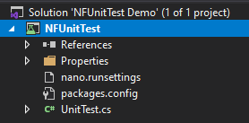
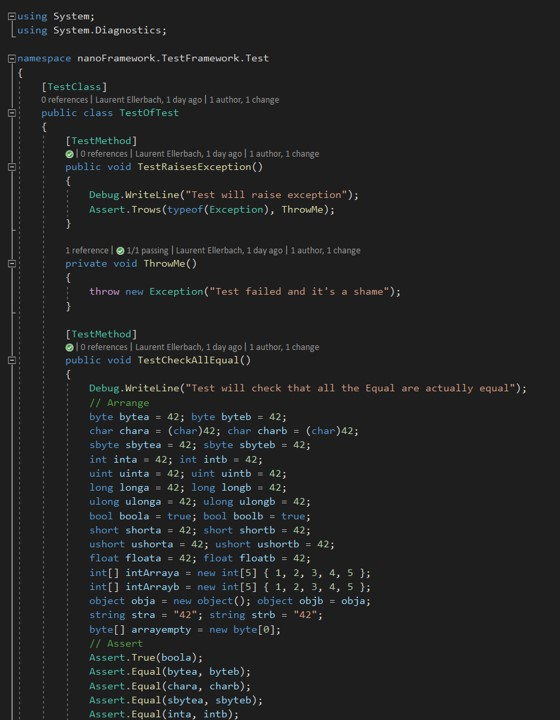

# Running Unit Tests on nanoFramework

You first need to setup your nanoFramework Unit Test project. For this, you have 2 options, either you create a `NFUnitTest` project from Visual Studio, either you add a the nanoFramework.TestFramework nuget to your class library project.

## Setting up through Visual Studio project template

You can as well simply create a new Visual Studio NFUnitTest project that will already contains all the needed elements.



### Setting up Unit Test through nuget

The nanoFramework Unit Test platform is available thru a nuget and comes with all the needed element. The only thing you need to do it to add it to your nanoFramework project:


Make sure you create in the main directory of your sln file or in the same directory as your nfproj a `.runsettings` and the minium elements you need are:

```xml
<?xml version="1.0" encoding="utf-8"?>
<RunSettings>
   <!-- Configurations that affect the Test Framework -->
   <RunConfiguration>
       <MaxCpuCount>1</MaxCpuCount>
       <ResultsDirectory>.\TestResults</ResultsDirectory><!-- Path relative to solution directory -->
       <TestSessionTimeout>120000</TestSessionTimeout><!-- Milliseconds -->
       <TargetFrameworkVersion>Framework40</TargetFrameworkVersion>
   </RunConfiguration>
   <nanoFrameworkAdapter>
    <Logging>None</Logging>
   </nanoFrameworkAdapter>
</RunSettings>
```

The most important part is the `<TargetFrameworkVersion>Framework40</TargetFrameworkVersion>` as this is what trigger the discovery of the tests.

## Discover the tests

Once you'll build your project, the tests will be discovered automatically:


This is automatic and you just need to build. If any issue, you can try the `Rebuild` option, it will force a rediscovery of the tests.

## Running the tests

Simply press the play button for all the tests or just the test you want to run. In case of success, you'll see something like this:


In case one of your test will fail, you'll see this:


## Test coverage and code highlighting

As you can expect in your code, you'll get the covered tests on the tests methods but as well on the methods that have been called:



In case of failure, you'll get the same:


## Running the tests in a pipeline

The tests can be run in a pipeline using `vstest.Console.exe`. The adapter to use is `nanoFramework.TestAdapter.dll`. You'll find all this into the nuget package.
